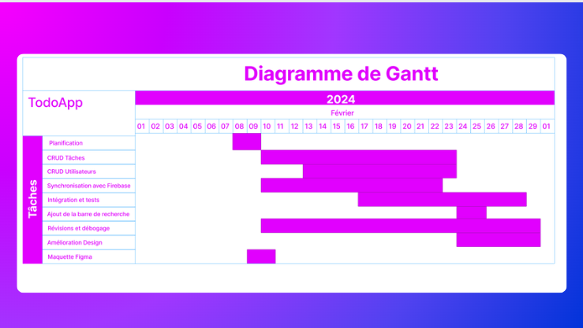

# [TodoAPP]

Bienvenue dans [TodoAPP] - Votre Assistant Quotidien

## 1. Inscription Simple et Rapide

- Créez votre compte en quelques clics pour commencer à organiser votre vie de manière plus efficace.

## 2. Personnalisation Totale

- Ajoutez, modifiez et supprimez vos propres tâches personnalisées en fonction de vos besoins uniques.
- Choisissez des couleurs, des icônes ou même des catégories pour donner une touche personnelle à vos todos.

## 3. Intuitif et Convivial

- Interface utilisateur élégante et conviviale pour une expérience utilisateur optimale.
- Glissez-déposez pour réorganiser vos tâches, faites glisser pour marquer comme terminé - la gestion des todos n'a jamais été aussi simple.

## 4. Synchronisation Multiplateforme

- Accédez à vos todos à partir de n'importe quel appareil - smartphone, tablette, ou ordinateur de bureau.
- Vos données sont toujours synchronisées en temps réel pour une accessibilité maximale.

## 5. Évoluez avec Votre Vie

- Modifiez vos informations personnelles à tout moment pour rester à jour.

Maquette Figma UX et UI :
https://www.figma.com/file/yS6qQsOgLKQr62iFJyGQLM/To-do-list-(Community)?type=design&node-id=0%3A1&mode=design&t=TciDtpURBcMPlmlT-1

**Captures d'écran :**

